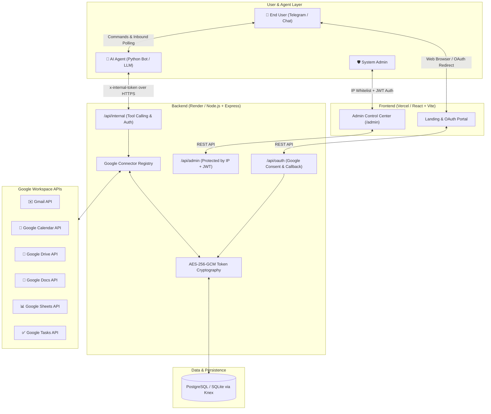

# AskMyAgent 🤖⚡

> **Enterprise-grade Google Workspace connector and management platform for AI agents.** Seamlessly connect LLMs, autonomous agents, and Telegram bots to Gmail, Google Calendar, Google Drive, Google Docs, Google Sheets, and Google Tasks with bank-grade security, OAuth 2.0 lifecycle management, and fine-grained tool execution.

---

[](https://nodejs.org/)
[](https://www.typescriptlang.org/)
[](https://react.dev/)
[](https://vitejs.dev/)
[](https://tailwindcss.com/)
[](https://expressjs.com/)
[](https://knexjs.org/)
[](https://vitest.dev/)
[](LICENSE)

---

## 📑 Table of Contents

- [Overview](#-overview)
- [Architecture & Flow](#-architecture--flow)
- [Supported Google Workspace Connectors](#-supported-google-workspace-connectors)
- [Security & Privacy Architecture](#-security--privacy-architecture)
- [Project Structure](#-project-structure)
- [Getting Started](#-getting-started)
  - [Prerequisites](#prerequisites)
  - [Installation](#installation)
  - [Environment Configuration](#environment-configuration)
  - [Database Setup & Migrations](#database-setup--migrations)
  - [Running Locally](#running-locally)
- [Environment Variables Reference](#-environment-variables-reference)
  - [Backend Configuration (`backend/.env`)](#backend-configuration-backendenv)
  - [Frontend Configuration (`frontend/.env`)](#frontend-configuration-frontendenv)
- [Internal Agent API Reference](#-internal-agent-api-reference)
- [Testing](#-testing)
- [Deployment Guides](#-deployment-guides)
- [Documentation Index](#-documentation-index)
- [License](#-license)

---

## 🌟 Overview

**AskMyAgent** bridges AI agents (e.g. Gemini, OpenAI, Claude, Telegram bots) with personal and workspace productivity tools in Google Workspace. It eliminates the complexity of building per-user OAuth flows, token refreshes, safe tool schemas, and rate-limited API integrations.

### Key Capabilities:
- 🔐 **Multi-Tenant OAuth 2.0 Management**: Connect individual user accounts per Telegram `chat_id` or User ID with automated token refresh cycles.
- 🛡️ **Zero-Knowledge Token Security**: Encrypted OAuth refresh & access tokens using **AES-256-GCM** at rest.
- 🤖 **Turnkey Tool Execution API**: Exposes JSON Schema-compliant tool definitions directly compatible with Gemini Function Calling and OpenAI Tool Calling.
- 🚦 **Confirmation Guardrails**: Built-in 2-step human-in-the-loop confirmation mechanism for destructive or high-impact write operations (e.g. sending emails, deleting events, modifying docs).
- 📊 **Unified Admin Control Center**: Web-based monitoring for connected users, connector health, security events, audit logs, and rate limit tracking.
- 🌐 **Clean Monorepo & Decoupled Architecture**: High-speed Node.js/Express TypeScript backend with a sleek, responsive React 18 + Vite + Tailwind CSS frontend.

---

## 🏛 Architecture & Flow



---

## 🔌 Supported Google Workspace Connectors

Each connector provides pre-defined, parameter-validated tools with strict schema validation:

| Connector | Tools Available | Description |
| :--- | :--- | :--- |
| **✉️ Gmail** | `gmail_search`, `gmail_read_thread`, `gmail_send_message`, `gmail_create_draft`, `gmail_list_labels` | Search inbox, read full email threads, compose and send messages, generate drafts. |
| **📅 Google Calendar** | `calendar_list_events`, `calendar_today`, `calendar_create_event`, `calendar_update_event`, `calendar_delete_event` | Query agendas, inspect today's schedule, book meetings, reschedule, and delete events. |
| **📁 Google Drive** | `drive_search_files`, `drive_get_file_metadata`, `drive_upload_file`, `drive_read_file_content`, `drive_share_file` | Search files across drives, inspect metadata, read document contents, upload files, and share permissions. |
| **📝 Google Docs** | `docs_create_document`, `docs_read_document`, `docs_append_text`, `docs_insert_text` | Create new documents, extract raw text / structural elements, append logs, and insert content. |
| **📊 Google Sheets** | `sheets_read_rows`, `sheets_append_row`, `sheets_update_cells`, `sheets_create_spreadsheet` | Read tabular data, append rows, batch update cell ranges, create new sheets. |
| **✅ Google Tasks** | `tasks_list_tasklists`, `tasks_list_tasks`, `tasks_create_task`, `tasks_complete_task` | Manage task lists, add new items, query deadlines, and mark tasks completed. |

---

## 🛡️ Security & Privacy Architecture

- **Token Encryption at Rest**: All Google OAuth tokens (access tokens, refresh tokens) are encrypted using authenticated **AES-256-GCM** before database insertion (`ENCRYPTION_KEY`).
- **IP-Restricted Admin Control Center**: Access to administrative routes and the admin portal is protected by `ADMIN_ALLOWED_IPS` enforcement at the Express middleware layer.
- **Shared Secret Agent Authentication**: Direct tool execution and status inspection endpoints (`/api/internal/*`) require a strong shared token via `x-internal-token` (`INTERNAL_API_TOKEN`).
- **Decoupled Telegram Polling**: The backend is completely stateless and handles **zero** inbound webhook polling conflicts—the inbound listener is handled exclusively by your AI Agent / VM bot, while this service acts as the secure tool execution engine.
- **Rate Limiting & Threat Defense**: Outfitted with [Helmet](https://helmetjs.github.io/) HTTP security headers, [express-rate-limit](https://express-rate-limit.mintlify.app/) rate limiting, parameterized Knex queries against SQL injection, and strict CORS policies.
- **Write Confirmations**: Destructive write actions (sending emails, modifying spreadsheets, deleting calendar entries) can trigger intermediate confirmation requests, preventing accidental bot executions.

---

## 📁 Project Structure

```text
AskMyAgent/
├── backend/                        # Node.js + Express + TypeScript Backend
│   ├── src/
│   │   ├── bot/                    # Outbound bot messaging & notification helpers
│   │   ├── config/                 # Environment validation & app constants
│   │   ├── confirmation/           # 2-step write operation confirmation manager
│   │   ├── connectors/             # Google Workspace connector implementations
│   │   │   ├── calendar/           # Google Calendar connector & tools
│   │   │   ├── docs/               # Google Docs connector & tools
│   │   │   ├── drive/              # Google Drive connector & tools
│   │   │   ├── gmail/              # Gmail connector & tools
│   │   │   ├── sheets/             # Google Sheets connector & tools
│   │   │   ├── tasks/              # Google Tasks connector & tools
│   │   │   ├── base.ts             # Abstract connector base class
│   │   │   └── registry.ts         # Centralized connector registry
│   │   ├── database/               # Knex migrations, connection pooling & schema
│   │   ├── middleware/             # IP whitelist, auth JWT, rate limiting, error handlers
│   │   ├── oauth/                  # Google OAuth 2.0 flow & callback handler
│   │   ├── quota/                  # Rate & quota tracking
│   │   ├── routes/                 # REST endpoints (internal, admin, oauth, users)
│   │   ├── services/               # User, audit log, security events services
│   │   ├── utils/                  # AES-256-GCM crypto & response helpers
│   │   └── index.ts                # Backend server entry point
│   ├── tests/                      # Vitest backend integration and unit tests
│   └── package.json
│
├── frontend/                       # React 18 + Vite + Tailwind CSS Frontend
│   ├── src/
│   │   ├── components/             # Reusable UI components & ErrorBoundary
│   │   ├── pages/                  # Landing, Dashboard, Login, OAuthCallback, Policies
│   │   ├── lib/                    # API client utilities and helpers
│   │   ├── App.tsx                 # Client routing & layout
│   │   └── main.tsx                # Frontend entry point
│   ├── public/                     # Static assets & icons
│   └── package.json
│
├── docs/                           # Comprehensive technical & deployment documentation
│   ├── DEPLOYMENT_RENDER.md        # Render deployment guide for backend
│   ├── DEPLOYMENT_VERCEL.md        # Vercel deployment guide for frontend
│   ├── DATABASE_MIGRATION.md       # PostgreSQL & SQLite migration guide
│   ├── POSTGRES_BACKUP.md          # Database backup & disaster recovery
│   ├── PRODUCTION_CHECKLIST.md     # Production readiness & security verification
│   └── SERVER_OWNER.md             # Infrastructure & VPS management operations
│
├── package.json                    # Monorepo root workspace configuration
└── render.yaml                     # Render Infrastructure-as-Code blueprint
```

---

## 🚀 Getting Started

### Prerequisites

- **Node.js**: `v20.0.0` or higher
- **npm**: `v9.0.0` or higher
- **Google Cloud Console Project**:
  - Enable Gmail API, Google Calendar API, Google Drive API, Google Docs API, Google Sheets API, Google Tasks API.
  - Create OAuth 2.0 Web Application Client Credentials.

### Installation

Clone the repository and install all monorepo dependencies:

```bash
git clone https://github.com/indrajit-edge/askmyagent_bot.git
cd askmyagent_bot
npm install
```

### Environment Configuration

1. **Configure Backend**:
   ```bash
   cp backend/.env.example backend/.env
   ```
   Generate secure encryption and JWT keys:
   ```bash
   # Generate 32-byte AES key (hex)
   node -e "console.log(crypto.randomBytes(32).toString('hex'))"

   # Generate JWT Secret (base64url)
   node -e "console.log(crypto.randomBytes(32).toString('base64url'))"

   # Generate Internal API Token
   openssl rand -hex 32
   ```

2. **Configure Frontend**:
   ```bash
   cp frontend/.env.example frontend/.env
   ```

### Database Setup & Migrations

For local development with SQLite:
```bash
npm run db:migrate --workspace=backend
```

For production PostgreSQL databases, set `DATABASE_URL=postgres://...` in `backend/.env` and execute the migration script.

### Running Locally

Start both the backend API server and frontend Vite development server concurrently:

```bash
# Start both backend (port 4000) and frontend (port 5173)
npm run dev
```

Or run services individually:
```bash
# Backend only (http://localhost:4000)
npm run dev:backend

# Frontend only (http://localhost:5173)
npm run dev:frontend
```

---

## ⚙️ Environment Variables Reference

### Backend Configuration (`backend/.env`)

| Variable | Required | Default | Description |
| :--- | :---: | :--- | :--- |
| `PORT` | No | `4000` | HTTP port for the Express backend server. |
| `NODE_ENV` | No | `development` | Environment mode (`development` / `production`). |
| `FRONTEND_URL` | Yes | `http://localhost:5173` | Allowed frontend origin for OAuth callbacks and CORS. |
| `CORS_ORIGIN` | Yes | `http://localhost:5173` | CORS allowed origin headers. |
| `DATABASE_URL` | Prod | `undefined` | PostgreSQL connection URI (e.g. Supabase, Neon, Render Postgres). |
| `DB_SSL` | Prod | `false` | Enables SSL for PostgreSQL database connections. |
| `DATABASE_PATH` | Dev | `database.sqlite` | SQLite database file path when `DATABASE_URL` is omitted. |
| `ENCRYPTION_KEY` | **Yes** | — | 64-character hexadecimal key (32 bytes) for AES-256-GCM token encryption. |
| `JWT_SECRET` | **Yes** | — | Random high-entropy secret for signing admin JWT session tokens. |
| `INTERNAL_API_TOKEN` | **Yes** | — | Shared secret token required in `x-internal-token` for agent tool execution. |
| `ADMIN_USERNAME` | Yes | — | Username for Admin Control Center login. |
| `ADMIN_PASSWORD_HASH`| Yes | — | Bcrypt hash of the Admin password (`$2b$12$...`). |
| `ADMIN_ALLOWED_IPS` | Prod | `127.0.0.1` | Comma-separated list of allowed client IP addresses for `/admin` routes. |
| `GOOGLE_CLIENT_ID` | **Yes** | — | Google Cloud OAuth 2.0 Web Application Client ID. |
| `GOOGLE_CLIENT_SECRET`| **Yes** | — | Google Cloud OAuth 2.0 Client Secret. |
| `GOOGLE_REDIRECT_URI` | **Yes** | `http://localhost:4000/api/oauth/callback` | OAuth redirect URI configured in Google Cloud Console. |
| `TELEGRAM_BOT_TOKEN` | No | `undefined` | *(Outbound notifications only)* Used to send OAuth completion messages. |

### Frontend Configuration (`frontend/.env`)

| Variable | Required | Default | Description |
| :--- | :---: | :--- | :--- |
| `VITE_API_BASE_URL` | Yes | `http://localhost:4000` | Backend API base URL for production builds. |
| `VITE_TELEGRAM_BOT_URL` | Yes | `https://t.me/AskMyAgentBot` | Direct URL link to the Telegram bot. |
| `VITE_TELEGRAM_BOT_USERNAME` | Yes | `AskMyAgentBot` | Bot username without `@` prefix. |

---

## 🤖 Internal Agent API Reference

AI Agents authenticate against `/api/internal/*` by supplying the header:
```http
x-internal-token: <INTERNAL_API_TOKEN>
```

### 1. Execute a Workspace Tool
```http
POST /api/internal/tool-call
Content-Type: application/json
x-internal-token: <INTERNAL_API_TOKEN>

{
  "chat_id": 123456789,
  "tool_name": "calendar_today",
  "args": {}
}
```

**Response**:
```json
{
  "success": true,
  "data": {
    "events": [
      {
        "id": "abc123event",
        "summary": "Product Review",
        "start": "2026-09-08T10:00:00Z",
        "end": "2026-09-08T11:00:00Z"
      }
    ]
  }
}
```

### 2. Retrieve All Function Calling Tool Schemas
```http
GET /api/internal/tools
x-internal-token: <INTERNAL_API_TOKEN>
```
Returns a list of all active tools with JSON Schema parameters ready to pass to Gemini or OpenAI function calling APIs.

### 3. Generate OAuth Authorization URL for a User
```http
POST /api/internal/oauth/start
Content-Type: application/json
x-internal-token: <INTERNAL_API_TOKEN>

{
  "chat_id": 123456789,
  "provider": "google"
}
```

### 4. Check Connector Authorization Status
```http
GET /api/internal/oauth/status?chat_id=123456789&provider=google
x-internal-token: <INTERNAL_API_TOKEN>
```

---

## 🧪 Testing

The repository uses [Vitest](https://vitest.dev/) for unit and integration testing.

```bash
# Run all workspace test suites
npm test

# Run backend tests only
npm run test:backend

# Run frontend tests only
npm run test:frontend
```

---

## 🚢 Deployment Guides

| Target | Description | Guide Link |
| :--- | :--- | :--- |
| **Render** | Recommended backend web service deployment with managed PostgreSQL | [Render Deployment Guide](docs/DEPLOYMENT_RENDER.md) |
| **Vercel** | Recommended frontend SPA static build deployment | [Vercel Deployment Guide](docs/DEPLOYMENT_VERCEL.md) |
| **Database Migration** | Guidance for migrating between SQLite and PostgreSQL | [Database Migration Guide](docs/DATABASE_MIGRATION.md) |
| **Production Checklist** | Comprehensive security and pre-flight verification checklist | [Production Checklist](docs/PRODUCTION_CHECKLIST.md) |
| **Server Owner Operations** | Systemd, Nginx, SSL, and VPS maintenance operations | [Server Owner Guide](docs/SERVER_OWNER.md) |

---

## 📚 Documentation Index

For in-depth operational and architectural details, check out the `docs/` folder:
- 📖 [Deployment Overview (`DEPLOYMENT.md`)](docs/DEPLOYMENT.md)
- 🚀 [Render Backend Deployment (`DEPLOYMENT_RENDER.md`)](docs/DEPLOYMENT_RENDER.md)
- ⚡ [Vercel Frontend Deployment (`DEPLOYMENT_VERCEL.md`)](docs/DEPLOYMENT_VERCEL.md)
- 🗄️ [Database Migrations (`DATABASE_MIGRATION.md`)](docs/DATABASE_MIGRATION.md)
- 💾 [PostgreSQL Backups (`POSTGRES_BACKUP.md`)](docs/POSTGRES_BACKUP.md)
- ✅ [Production Readiness Checklist (`PRODUCTION_CHECKLIST.md`)](docs/PRODUCTION_CHECKLIST.md)
- 🛠️ [Server Owner Operations Guide (`SERVER_OWNER.md`)](docs/SERVER_OWNER.md)

---

## 📄 License

This project is licensed under the MIT License - see the [LICENSE](LICENSE) file for details.
